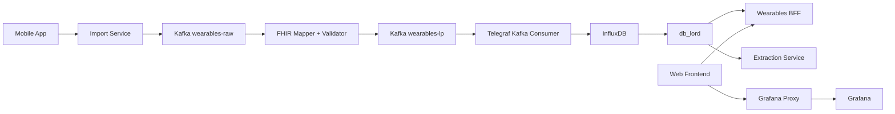

<p align="center">
  
</p>
<h1 align="center">Cloud-Native Wearable Analytics Framework</h1>
<p align="center">
  Clinical wearable data platform: ingestion, mapping, storage, extraction, and web/mobile experience.
</p>
<p align="center">
  
  
  
  
  
</p>
<p>
This repository is part of a research project at Charité – Universitätsmedizin Berlin. It contains the software platform developed to support a clinical study on wearable-derived digital biomarkers, covering data ingestion from wearable devices (e.g., smartwatches), mapping to standardized clinical formats (FHIR), storage, researcher-facing data extraction, and a web/mobile application layer for study participants and clinical staff.

The platform is designed to support clinical research workflows in which wearable sensor data (e.g., heart rate variability and related metrics) is collected, processed, and made available for analysis alongside clinical outcome measures, in compliance with applicable data protection requirements.

**Preprint:** Coming soon — [.](#)

**Contact:** Dr.-Ing. Elias Grünewald — elias.gruenewald@charite.de
</p>

## Overview
This repository contains the Wearables platform end-to-end:
- mobile data collection
- backend APIs and stream processing
- schema and API contract generation
- frontend and dashboard embedding
- Kubernetes/GitOps deployment assets
- benchmarking and architecture artifacts
## Platform Flow

Notes:
- `wearables-bff` integrates with `db_lord` through `DATABASE_API_URL` (`services/backend/wearables-bff/src/clients/databaseApi.ts`).
- `extraction-service` is researcher-facing and queries `db_lord`; it is not part of the web frontend request path.
- Web monitoring embeds dashboards through `grafana-proxy` (`services/web/src/pages/case/CasePage.tsx`).
- `importservice` validates case-verification JWTs via `JWT_SECRET` + `JWT_ISSUER` (`services/backend/importservice/app/security.py`), so the issuer and secret must match your token issuer.
## Repository Map
| Path | Purpose |
|---|---|
| `services/web` | React + Vite frontend for auth, case management, and monitoring UI |
| `services/mobile/mobile_app` | Flutter mobile app (`wearables_app_tub`) |
| `services/backend/wearables-bff` | Main BFF/API layer for web clients |
| `services/backend/grafana-proxy` | Grafana reverse proxy with JWT/session validation |
| `services/backend/importservice` | FastAPI ingestion endpoint to Kafka |
| `services/backend/fhir-mapper-validator` | Kafka Streams mapper/validator to FHIR + line protocol |
| `services/backend/db_lord` | Data management service for storage/query workflows |
| `services/backend/extraction-service` | Researcher-facing extraction API (JSON + CSV export) |
| `services/backend/wplug` | Go load generator for workload testing scenarios |
| `services/backend/clinical-analytics` | Legacy/minikube-oriented platform deployment assets |
| `services/packages/api-schema` | Zod-based API schema source, generates `openapi.json` |
| `gitops` | Helm charts and Kubernetes deployment manifests |
| `infra` | Terraform + Ansible infrastructure automation |
| `ci-cd` | GitHub Actions workflow definitions and CI/CD helper assets |
| `observability` | Dashboard JSON and monitoring artifacts |
| `benchmarks` | Benchmark runner, jobs, measurements, and evaluation |
| `docs` | Architecture docs, migration notes, and presentations |
## Quick Start (Web + BFF)
1. Install dependencies:
```bash
npm --prefix services/backend/wearables-bff install
npm --prefix services/web install
```
2. Create local env files:
```bash
cp services/backend/wearables-bff/.env.example services/backend/wearables-bff/.env
cp services/web/.env.example services/web/.env
```
3. For local browser access, set these in `services/backend/wearables-bff/.env`:
```dotenv
FRONTEND_ORIGINS=http://localhost:5173
FRONTEND_REDIRECT_URL=http://localhost:5173
BACKEND_URL=http://localhost:3001
```
4. Start local development (runs BFF and web frontend):
```bash
npm --prefix services/web run dev
```
5. Open `http://localhost:5173`.
## Optional: Local Grafana Proxy
```bash
npm --prefix services/backend/grafana-proxy install
cp services/backend/grafana-proxy/.env.example services/backend/grafana-proxy/.env
npm --prefix services/backend/grafana-proxy run dev
```
Keep JWT settings aligned across services:
- `services/backend/wearables-bff/.env` -> `JWT_SECRET`, `TOKEN_ISSUER`
- `services/backend/grafana-proxy/.env` -> `APP_JWT_SECRET`, `APP_JWT_ISSUER`
## Token Alignment (Mobile Ingest)
For QR/app ingestion to work end-to-end, align case-token settings between the issuer and the validator:
- Token issuer service (`wearables-bff`) uses `TOKEN_ISSUER` + `JWT_SECRET`.
- Token validator (`importservice`) checks `JWT_ISSUER` + `JWT_SECRET`.
- If those differ, `/ingest` rejects tokens with `401 Invalid issuer`.
## API Contract Workflow
`services/packages/api-schema` is the contract source of truth.
Regenerate schema and clients:
```bash
npm --prefix services/packages/api-schema install
npm --prefix services/packages/api-schema run generate:api-schema
npm --prefix services/backend/wearables-bff run generate:api
npm --prefix services/web run generate:api
```
## Kubernetes / GitOps Entry Points
- Unified runtime deploy flow: `docs/deploy-runtime-config.md`
- Frontend chart: `gitops/apps/web-frontend/README.md`
- BFF chart: `gitops/apps/services/wearables-bff/README.md`
- Grafana proxy chart: `gitops/apps/monitoring/grafana-proxy/README.md`
- Extraction service chart: `gitops/apps/services/extraction-service/README.md`
- DB Lord chart: `gitops/apps/services/db-lord/README.md`
## Benchmarks and Evaluation
- Benchmark suite: `benchmarks/README.md`
- Example plots/data: `benchmarks/evaluation/`
- Runner implementation: `benchmarks/runner/`
## Migration Context
This monorepo was assembled from multiple project repositories with preserved history during development.
- Migration summary: `docs/migration/MIGRATION_SUMMARY.md`
- Recorded migration date: **2025-12-06**
## Contributors
- TBA
